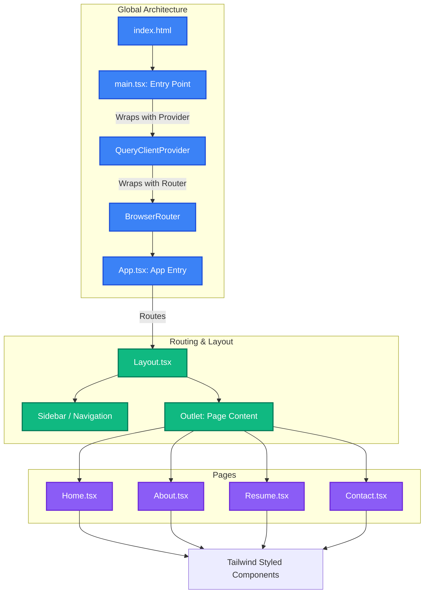

# Personal Portfolio

A modern, responsive personal portfolio web application built with React, TypeScript, and Vite. The application showcases projects, skills, and experience with a clean and interactive user interface.

## 🚀 Technologies Used

- **Framework**: [React 19](https://react.dev/)
- **Language**: [TypeScript](https://www.typescriptlang.org/)
- **Build Tool**: [Vite](https://vitejs.dev/)
- **Routing**: [React Router v7](https://reactrouter.com/)
- **State/Data Management**: [TanStack React Query](https://tanstack.com/query/latest)
- **Styling**: [Tailwind CSS](https://tailwindcss.com/)
- **Linting**: ESLint with TypeScript hooks

## 🏗️ Architecture & Project Structure

The project follows a component-based architecture where the UI is broken down into reusable components and distinct page views. The application is wrapped with global providers (React Router, React Query) at the entry point.

### Application Architecture Diagram



### Folder Structure

```text
d:\Protfolio
├── public/                 # Static assets (favicons, manifest, etc.)
├── src/                    # Application source code
│   ├── assets/             # Images, fonts, and other asset files
│   ├── components/         # Reusable React components (e.g., Layout)
│   ├── pages/              # Route-level components (Home, About, Resume, Contact)
│   ├── App.tsx             # Main application component & route definitions
│   ├── main.tsx            # Application entry point & React root
│   └── index.css           # Global stylesheets & Tailwind directives
├── index.html              # HTML template
├── package.json            # Project dependencies and scripts
├── tailwind.config.js      # Tailwind CSS configuration
├── tsconfig.json           # TypeScript configuration
└── vite.config.ts          # Vite bundler configuration
```

## 🛠️ Setup & Installation

To run this project locally, follow these steps:

### Prerequisites

Ensure you have [Node.js](https://nodejs.org/) installed (v18 or higher recommended). Use of a package manager like `npm`, `yarn`, or `pnpm` is required. `pnpm` is recommended as there is a `pnpm-lock.yaml` file present.

### Installation Steps

1. **Clone the repository** (if you haven't already):
   ```bash
   git clone https://github.com/shristi2211/Portfolio_Shristi.git
   cd Portfolio_Shristi
   ```

2. **Install dependencies**:
   ```bash
   pnpm install
   ```

3. **Start the development server**:
   ```bash
   pnpm dev
   ```
   *The application will be accessible at `http://localhost:5173/` by default.*

4. **Build for production**:
   ```bash
   pnpm build
   ```
   *This will generate a compiled bundle in the `dist/` directory.*

5. **Preview the production build**:
   ```bash
   pnpm preview
   ```

## 📜 Available Scripts

- `dev` (`vite`): Starts the Vite development server with Hot Module Replacement (HMR).
- `build` (`tsc -b && vite build`): Type-checks the TypeScript code and then bundles the application.
- `lint` (`eslint .`): Runs ESLint over the project to find and fix problems.
- `preview` (`vite preview`): Boots up a local static web server that serves the files from `dist` to let you preview your production build.

## ✨ Features

- **Responsive Design**: Mobile-first architecture using Tailwind CSS, ensuring the portfolio looks stunning on all devices.
- **Client-Side Routing**: Fast, seamless page transitions using React Router v7.
- **Modern React**: Employs React 19 methodologies including Hooks and functional components.
- **Type Safety**: Fully built with TypeScript to catch errors early and enhance developer experience.
